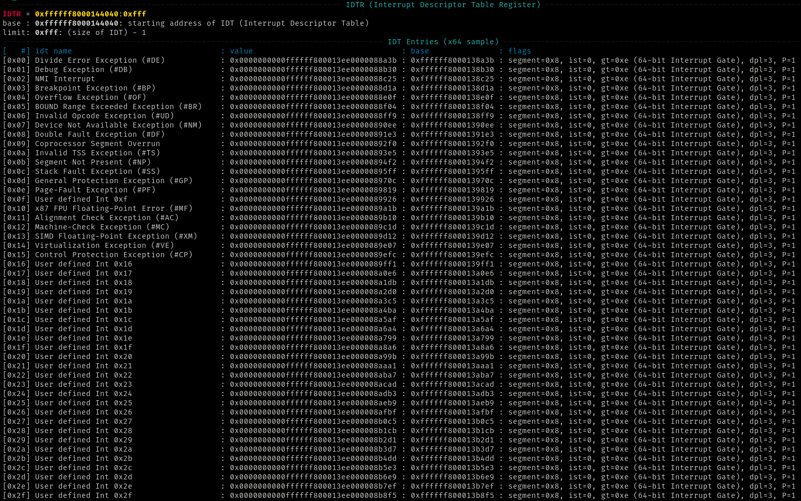

## GEF24

This is a fork of [GEF](https://github.com/bata24/gef) from @bata24.
The aim of this fork is to just some additional features

## Setup

### Install

```bash
wget -q https://raw.githubusercontent.com/timetravelthree/gef24/dev/install.sh -O- | sh
```

### Upgrade (replace itself)
```bash
python3 ${HOME}/.gdbinit-gef24.py --upgrade
```

### Uninstall

```bash
rm -f ${HOME}/.gdbinit-gef24.py /${HOME}/.gef.rc
sed -i -e '/source \/${HOME}\/.gdbinit-gef24.py/d' /${HOME}/.gdbinit
```

### Dependency
See [install.sh](https://github.com/timetravelthree/gef24/blob/dev/install.sh) or
[install-minimal.sh](https://github.com/timetravelthree/gef24/blob/dev/install-minimal.sh).


## Added / Improved features

- installation without root
- `idtinfo` -> added command for printing idt gates
- `ksymaddr-*` -> improved compatibility for most linux kernels

## General
* `idtinfo`: displays the idt gates
    * It also prints the details each section of the entry
    


## Todo

- [ ] Better file structure, this is because of large files are harder to work with excpecially with an IDE
- [ ] Improve `idtinfo` to add 32 bit support
